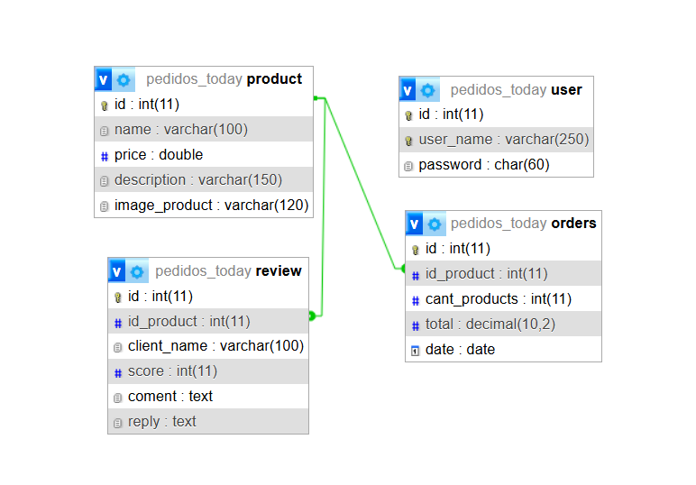
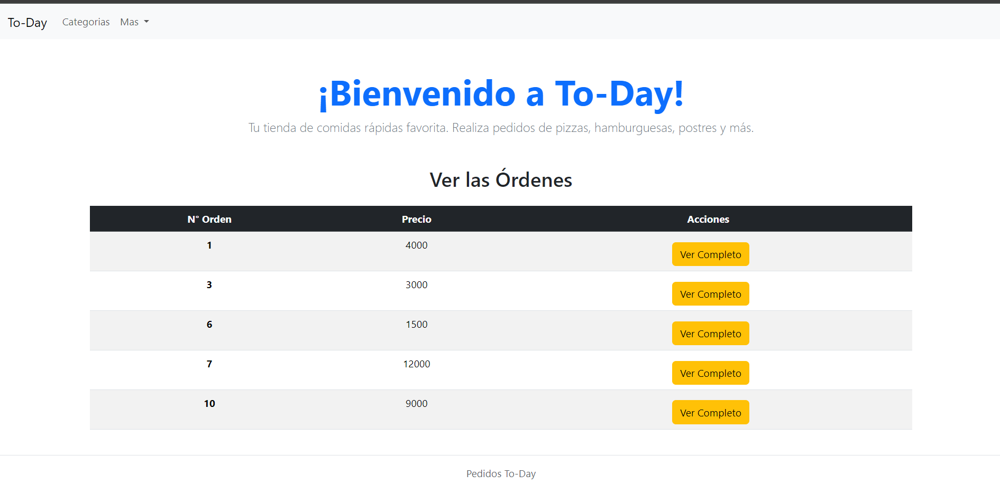
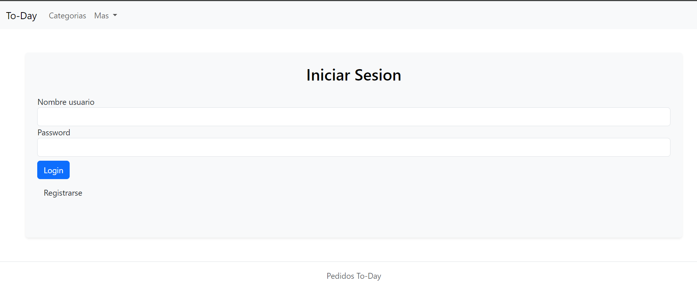
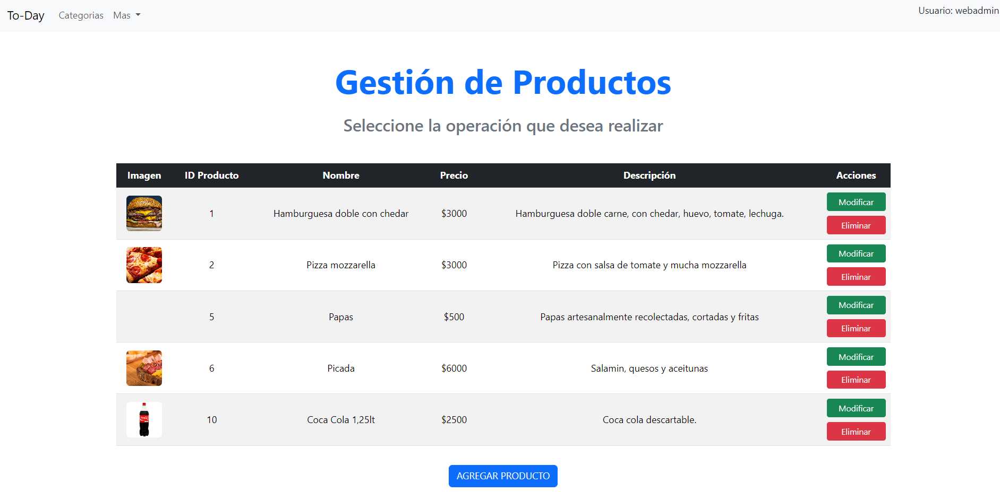

# 🍔 Burger Station - Full-Stack Order Management System

Welcome! This project is a comprehensive solution for managing a fast-food burger restaurant. The application is divided into two independent components: a robust Backend (API REST) and a dynamic Frontend based on the MVC architecture that consumes these services.

---  

## 🌐 Live Demo

You can explore the fully functional live application here:
* **Live Website:** [Burger Station Demo](https://mariagiana.infinityfree.me/burger-station/frontend/)

## 🌐 Live API Testing (Public GET Endpoints)

You can interact directly with the production database by clicking the links below to receive raw JSON data:

* **Get All Products:** [GET /products](https://mariagiana.infinityfree.me/burger-station/backend/router.php?resource=products)
* **Get All Reviews:** [GET /reviews](https://mariagiana.infinityfree.me/burger-station/backend/router.php?resource=reviews)
Test a complex query (2 filters + DESC order + Pagination) directly in your browser:
* **Filter by Name ("Hamburguesa") + Price (3000), Order by Price DESC, Page 1:**
  [GET /products?name=Hamburguesa&price=3000&orderBy=price&order=desc&page=1](https://mariagiana.infinityfree.me/burger-station/backend/products?name=Hamburguesa&price=3000&orderBy=price&order=desc&page=1)
* **Filter by Min Articles (1) + Total < 5000, Order by Total DESC, Page 1:**
  [GET /orders?cant_products=1&total_minor=5000&orderBy=total&order=desc&page=1](https://mariagiana.infinityfree.me/burger-station/backend/orders?cant_products=1&total_minor=5000&orderBy=total&order=desc&page=1)
  * **Filter by Client Name ("Juan") + Score (5), Order by Score DESC, Page 1:**
  [GET /reviews?name=Juan&score=5&orderBy=score&order=desc&page=1](https://mariagiana.infinityfree.me/burger-station/backend/reviews?name=Juan&score=5&orderBy=score&order=desc&page=1)

---  

## 🛠️ Technologies Used
- **Backend:** Native PHP (OOP), MVC Architecture, Custom Semantic Routing System.
- **Frontend:** HTML5, CSS3, PHP templates (`.phtml`), Vanilla JavaScript.
- **Database:** MySQL / MariaDB.
- **Security:** Session-based Authentication (Frontend) and JSON Web Tokens (JWT) (Backend).

---

## 📁 Project Structure

The repository is organized modularly to separate responsibilities cleanly:

- **/backend:** Houses the pure REST API exposing the endpoints required to interact with system resources.
- **/frontend:** Contains the graphical interface, styles, and template system that consumes the business logic.
- **/backend/db:** Includes the `.sql` script ready to import and set up the database locally.

---

## 📊 Entity-Relationship Model  
The database consists of 4 main tables structured around a relational schema:
  
- **`product` (One-to-Many with `orders` and `review`):** Stores the core menu items. A single product can be linked to multiple customer orders and can receive multiple user reviews.
- **`orders` (Many-to-One with `product`):** Tracks customer purchases. Each record connects back to a specific item via the `id_product` Foreign Key, calculating amounts based on quantity (`cant_products`) and `total` prices.
- **`review` (Many-to-One with `product`):** Manages feedback left by customers. Each comment and score is directly tied to an individual item through `id_product`, allowing administrators to submit replies directly.
- **`user` (Independent / Auth):** Stores administrative credentials (`user_name` and encrypted `password`) required to generate JSON Web Tokens (JWT) for protected system operations.
  
  

---  
      
## 📦 Local Deployment Guide

1. **Requirements:** Ensure you have a local server environment like **XAMPP** running with both Apache and MySQL modules enabled.
2. **Cloning:** Clone this repository into your server's root directory (e.g., `xampp/htdocs/burger-station/`).
3. **Database:** The system includes an Auto-Deploy feature for the database. If a manual import is preferred, the file is located at `backend/db/pedidos_today.sql` and can be loaded via phpMyAdmin.
4. **Admin Access (Frontend):** To perform administrative changes directly through the web interface, use the following credentials:
   - **Username:** `webadmin`
   - **Password:** `admin`

---

## ⚙️ REST API Documentation (`/backend`)

The API handles requests using the standard **JSON** format and supports full CRUD operations, advanced filtering, sorting, and pagination.

### 🔐 Authentication (JWT)
Certain administrative actions require authentication. To authenticate:
1. Make a **GET** request to the `/api/user/token` endpoint.
2. In your API client (Postman / Thunder Client) headers, send the credentials via **Basic Auth**:
   - **User:** `webadmin` | **Password:** `admin`
3. The API will return an access token. For protected endpoints, attach this token as a **Bearer Token**.

**Protected Actions:**
- **Products & Orders:** `POST`, `PUT`, `DELETE` operations require authorization.
- **Reviews:** `PUT`, `DELETE` operations require authorization.

---

### 🛣️ Available Endpoints

#### 🛒 1. Products (`/api/products`)

| Method | Endpoint | Description | Token Required |
| :--- | :--- | :--- | :---: |
| **GET** | `/api/products` | Retrieves a list of available products. | ❌ |
| **GET** | `/api/products/:id` | Retrieves details for a specific product. | ❌ |
| **POST** | `/api/products` | Creates a new product in the menu. | 🔐 |
| **PUT** | `/api/products/:id` | Modifies an existing product's data. | 🔐 |
| **DELETE**| `/api/products/:id` | Removes a product from the catalog. | 🔐 |

* **Query Parameters (GET):**
  - **Sorting:** `orderBy=name\|price\|id` (defaults to `id`). Set direction using `order=asc\|desc`.
  - **Filters:** `name` (partial search), `price` (exact match), `description` (partial search), `img` (partial match or lookup by null values).
* **Body Structure (POST/PUT):**
  ```json
  {
    "name": "Hamburguesa Doble Cheddar",
    "price": 4500,
    "description": "Doble carne, doble cheddar, salsa de la casa.",
    "image_product": "image_url_here"
  }
  

#### 📋 2. Orders (`/api/orders`)

| Method | Endpoint | DescriptionToken | Required |  
| :--- | :--- | :--- | :---: |
| **GET** | `/api/orders` | Lists all placed orders. | ❌ |
| **GET** | `/api/orders/:id` | Retrieves details for a specific order.| ❌ |
| **POST** | `/api/orders` | Registers a new purchase order.| 🔐 |
| **PUT** | `/api/orders/:id` | Updates order status or information. | 🔐 |
| **DELETE**| `/api/orders/:id` | Cancels/Deletes an order. | 🔐 |


* **Query Parameters (GET):**
  - **Sorting:** `orderBy=date\|total\|cant_products\|id_product` (defaults to `id`). Direction controlled with `order=asc\|desc`.
  - **Filters:** `id_product`, `total`, `cant_products`, `date` (format: `yyyy-mm-dd`), Range filters are also supported: `total_greater` ($>$) y `total_minor` ($<$).
* **Body Structure (POST/PUT):**
  ```json
  {
    "id_product": 2,
    "cant_products": 3,
    "date": "2026-05-26"
  }

#### 💬 3. Reviews (`/api/reviews`)

| Method | Endpoint | DescriptionToken | Required | 
| :--- | :--- | :--- | :---: |
| **GET** | `/api/reviews` | Lists customer reviews and feedback. | ❌ |
| **GET** | `/api/reviews/:id` | Retrieves a specific review. | ❌ |
| **POST** | `/api/reviews` | Allows a customer to add a new review. | ❌ |
| **PUT** | `/api/reviews/:id` | Modifies an entire existing review record. | 🔐 |
| **PUT** | `/api/reviews/:id/reply` | Optimized endpoint for admins to submit or edit a reply only. | 🔐 |
| **DELETE**| `/api/reviews/:id` | Deletes a comment from the system. | 🔐 |

* **Query Parameters (GET):**
  - **Sorting:**  `orderBy=score\|name\|id_product` (defaults to `id`). Direction controlled with `order=asc\|desc`.
  - **Filters:** `name`, `score`, `comment` (keyword search within comments), `reply` (keyword search within admin replies).
* **Body Structure (POST/PUT):**
  ```json
  {
    "id_product": 1,
    "client_name": "María G.",
    "score": 5,
    "comment": "Excelente atención y la comida llegó rapidísimo.",
    "reply": "¡Muchas gracias por elegirnos, María!"
  }
  
  
#### 📄 4. Global Pagination
Any resource collection endpoint supporting bulk data can be paginated by appending the following parameters to the query string: **?show=CANTIDAD_DE_ELEMENTOS&page=NUMERO_DE_PAGINA**

## 🖥️ Frontend Preview (UI Demo)

Here is a look at the responsive user interface developed for the burger restaurant orders:

### 🏠 Customer Orders
  

### 📊 Admin Dashboard (CRUD Operations)
Authorized administrators can log in to create, update, or delete products and manage customer orders in real-time.





*Developed for professional growth and academic purposes focusing on Full-Stack Software Architectures.*